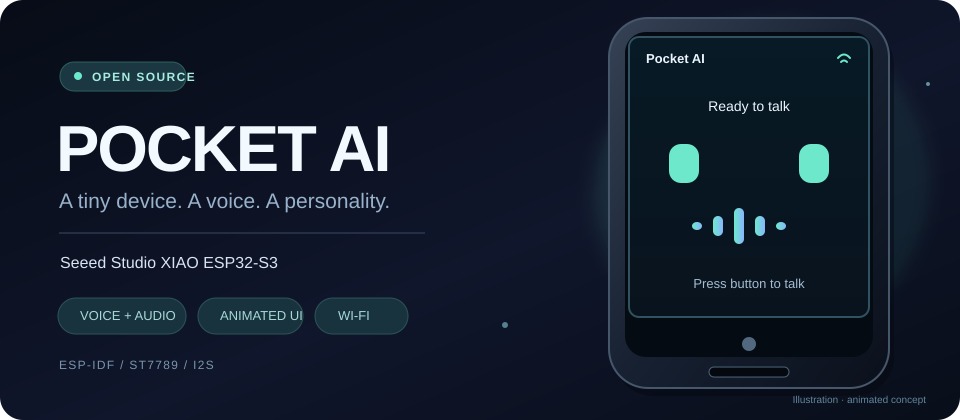
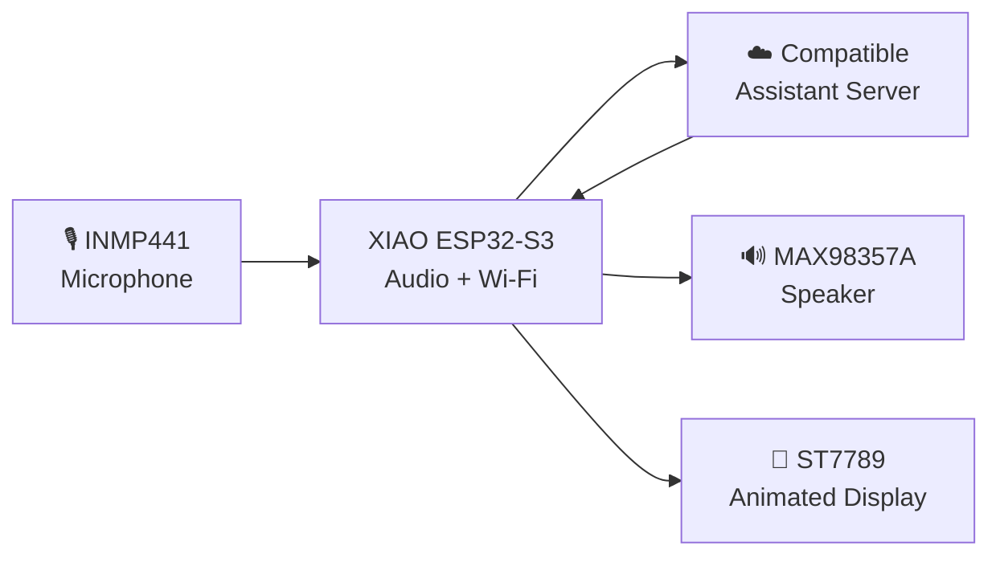
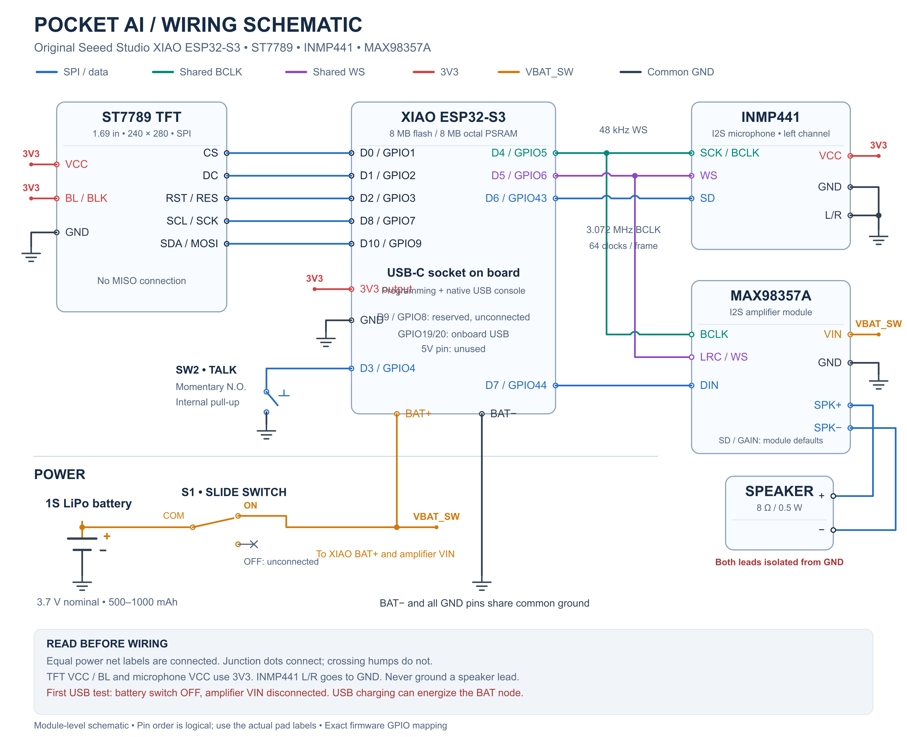

<div align="center">

# ✨ Pocket AI
### Seeed Studio XIAO ESP32-S3 · Mini Voice Assistant

**A tiny screen. An expressive face. A voice-powered companion.**



<br />


<br />

[](LICENSE)
[](https://github.com/espressif/esp-idf)
[](https://wiki.seeedstudio.com/xiao_esp32s3_getting_started/)
[](main/)

**[Explore the Features](#-what-it-does) · [Hardware](#-the-hardware) · [Get Started](#-getting-started) · [Wiring](#-wiring-at-a-glance) · [Technical Guide](README_XIAO_POCKET_AI.md)**

<sub>Animated artwork is an illustrative preview of the UI—not a photo or a recording of tested hardware.</sub>

</div>

---

## 🌟 Meet Pocket AI

**Pocket AI** is an open-source, handheld voice-assistant firmware project for the **original Seeed Studio XIAO ESP32-S3**. It combines a compact **240 × 280 ST7789 display**, an **INMP441 digital microphone**, and a **MAX98357A I²S speaker amplifier** into a small device that can listen, connect over Wi-Fi, and speak responses supplied by a compatible cloud service.

The display gives the assistant a personality: **mint-colored animated eyes**, an activity waveform, and text for connection, conversation, and activation states. The firmware is built with **ESP-IDF** and integrates with the [XiaoZhi ESP32](https://github.com/78/xiaozhi-esp32) software stack.

> [!NOTE]
> This repository targets the **XIAO ESP32-S3**. For the classic ESP32 NodeMCU build with a **landscape face, custom Vercel backend and Gemini Live**, see the separate [ESP32 NodeMCU Assistant](https://github.com/shreeharsh-patil/Esp-32-Node-MCU-Assistant). The XIAO firmware does **not** embed a Gemini API key or run an LLM locally.

## 🎭 What it does

| | Feature | Description |
|:--:|---|---|
| 🎙️ | **Voice conversations** | Button-controlled microphone capture and spoken cloud responses over the upstream assistant protocol. |
| 👀 | **Expressive display** | Blinking eyes, state-dependent eye shapes, animated audio bars and readable status messages. |
| 📶 | **Wi-Fi setup** | First-time provisioning through a device-hosted Wi-Fi hotspot and browser. |
| 🔊 | **Digital audio** | INMP441 mic and MAX98357A amplifier share I²S timing, with speaker volume limiting and recovery logic. |
| 💬 | **Conversation feedback** | On-screen listening, thinking, speaking, connection and activation information. |
| 🔌 | **Device tools** | Integrates with upstream Model Context Protocol (MCP) facilities. |
| 🛠️ | **Open firmware** | ESP-IDF project with board-specific configuration, host tests and build tooling. |

### The personality on screen

The current board display implementation uses lightweight LVGL geometry. It changes the face and bars to match device state, without needing a stream of full-screen animation images.

| State | On-screen behavior |
|---|---|
| **Idle** | Eyes remain visible with periodic blinks. |
| **Listening** | Eye objects form a pulsing microphone-like symbol; waveform responds through its animation cycle. |
| **Thinking / connecting** | Small bars animate to indicate activity or waiting. |
| **Speaking** | Activity bars move while speech is being played. |
| **Error** | Eyes narrow and the screen shows a relevant status or retry message. |

> The illustration above conveys the visual direction. For the actual implementation, see [`pocket_display.cc`](main/boards/seeed-xiao-esp32s3-pocket-ai/pocket_display.cc). Animations in this README do **not** modify the device's firmware.

## 🧠 How it works



The **ESP32-S3 is the voice and UI device**, not the cloud language model. The upstream service supplies activation, model selection and response handling. **WebSocket** and **MQTT/UDP** are supported in the wider firmware stack; actual transport selection depends on the service.

## 🧩 The hardware

| Component | Specification | Role |
|---|---|---|
| **Microcontroller** | Original Seeed Studio **XIAO ESP32-S3** | Wi-Fi, processing, audio and display control |
| **Screen** | **ST7789 240 × 280** SPI TFT, commonly 1.69" | Eyes, status and text |
| **Microphone** | **INMP441** I²S MEMS mic | Digital audio input |
| **Audio amplifier** | **MAX98357A** I²S Class-D | Speaker output |
| **Speaker** | **8 Ω mini speaker**, sized to the available power budget | Spoken responses |
| **Input** | Momentary push button | Conversation and setup controls |
| **Power** | USB-C for first setup; protected 3.7 V single-cell LiPo for portable operation | Power and charging integration |

<details>
<summary><b>Why the original XIAO ESP32-S3?</b></summary>

The board packs a fast ESP32-S3, Wi-Fi and PSRAM support into a very small footprint. This firmware's build variant uses an **8 MB flash / 8 MB PSRAM** configuration. The original XIAO, XIAO Sense and XIAO Plus are not interchangeable wiring targets. Verify the markings and pinout on your actual board.

</details>

## 🔌 Wiring at a glance

The pinout below follows [`config.h`](main/boards/seeed-xiao-esp32s3-pocket-ai/config.h). **D-number labels are XIAO board pad labels, not GPIO numbers.**

| XIAO pad | GPIO | Module connection |
|---|---:|---|
| D0 | 1 | ST7789 CS |
| D1 | 2 | ST7789 DC |
| D2 | 3 | ST7789 RST |
| D3 | 4 | Push button to GND |
| D4 | 5 | **Both:** INMP441 SCK + MAX98357A BCLK |
| D5 | 6 | **Both:** INMP441 WS + MAX98357A LRC |
| D6 | 43 | INMP441 SD (data output) |
| D7 | 44 | MAX98357A DIN |
| D8 | 7 | ST7789 SCK / SCL |
| D9 | 8 | Reserved, leave unconnected |
| D10 | 9 | ST7789 SDA / MOSI |

**Power and remaining pins:** ST7789 VCC and BL/BLK, plus INMP441 VDD, connect to **3V3**. All modules share **GND**. Connect the INMP441 **L/R** selector to GND. The MAX98357A amplifier's supply follows the verified power plan in the full wiring guide; do not assume its VIN should be connected to 3V3 or the USB pin without checking the module and power budget.

> [!CAUTION]
> - Never connect **5 V** to the INMP441's VDD.
> - Connect the speaker across the amplifier's **SPK+ / SPK−**, **not** between a speaker terminal and GND.
> - For initial testing, use **USB-C with the amplifier supply and battery disconnected**, then bring up audio and the battery circuit in stages.
> - Verify battery **polarity, protection, charging path and switch wiring** before connecting a LiPo; never assume a battery pad becomes unpowered just because the switch is off.

<div align="center">
  
  <p><sub>Project wiring illustration. Cross-check with the board datasheet before applying power.</sub></p>
</div>

📖 **Detailed wiring, electrical limits, pin conflicts and safety checks:** [README_XIAO_POCKET_AI.md](README_XIAO_POCKET_AI.md)

## 🚀 Getting started

### Requirements

- **ESP-IDF v6.1** recommended (minimum upstream v6.0.1; ESP-IDF 5.x is not supported).
- Git, Python 3.10+, CMake and Ninja.
- The **original XIAO ESP32-S3**, a USB-C **data** cable and the connected hardware.
- A **2.4 GHz Wi-Fi** network and a compatible assistant service/account for cloud conversation.

### 1. Clone

```bash
git clone https://github.com/shreeharsh-patil/Seeed-studio-XIAO-ESP32--S3-Pocket-Mini.git
cd Seeed-studio-XIAO-ESP32--S3-Pocket-Mini
```

### 2. Activate ESP-IDF

```bash
# Linux / macOS — replace with your own ESP-IDF installation
source /path/to/esp-idf/export.sh
idf.py --version
```

On Windows, open an **ESP-IDF PowerShell environment** (or run your installation's `export.ps1`).

### 3. Build the XIAO-specific firmware

```bash
python scripts/build.py seeed-xiao-esp32s3-pocket-ai --name seeed-xiao-esp32s3-pocket-ai --language en-US --wake-word disabled
```

**Use this board variant**, rather than compiling the generic project with the wrong board selected. The dedicated variant configures the display, I²S pins, partition table and firmware identity.

For available variants and arguments:

```bash
python scripts/build.py --list-boards
```

### 4. Flash and monitor

Use the flash instructions and generated image/offsets from the [board flashing guide](README_XIAO_POCKET_AI.md#flash-and-monitor). In a correctly configured native ESP-IDF build environment, an example is:

```bash
idf.py -p /dev/ttyACM0 flash monitor
```

On Windows, replace the port with your actual COM port (for example `COM7`). If the board is not detected, use the **BOOT / RESET** sequence documented in the flashing guide.

> [!IMPORTANT]
> A freshly merged image may overwrite stored provisioning data. Follow the credential-preserving update instructions for normal subsequent flashes. Never flash an image built for the **NodeMCU** target onto the **XIAO ESP32-S3**.

### 5. Connect Wi-Fi and activate

1. Power the board and follow the **Wi-Fi setup message on the screen**.
2. Connect your phone or laptop to the device's displayed provisioning hotspot.
3. Open the configuration URL shown by the firmware, then enter **2.4 GHz Wi-Fi** credentials.
4. When prompted, use the activation code with the configured upstream compatible assistant service.
5. Once connected and activated, press the talk button to start a conversation.

The XIAO board variant enables **SoftAP provisioning** and has **BluFi disabled** by default. Model/provider credentials are supplied by the service, not baked into the board code.

## 🎮 Controls

| Action | Function |
|---|---|
| **Short press** | Start listening; press again to submit the recorded turn. |
| **Press during reply** | Interrupt the response and return to listening. |
| **Hold about 5 seconds** | Enter the supported Wi-Fi setup mode. |
| **Double press during provisioning** | Start/stop microphone recording and playback test. |
| **Triple press while idle/provisioning** | Request a quiet, brief speaker test tone. |

These actions describe the current board integration. Optional wake-word builds require additional testing and are **off by default**.

## ✅ Testing and limitations

The repository includes host-side tests for audio behavior and OTA safety:

```bash
python3 scripts/tests/test_pocket_audio.py
python3 scripts/tests/test_pocket_ota.py
```

For broader checks:

```bash
python3 -m unittest discover -s scripts/tests -v
```

**Software builds and simulated/host tests are not proof of hardware qualification.** Screen color and orientation, microphone quality, speaker temperature, power consumption, Wi-Fi reconnection and end-to-end conversations all need verification on the assembled device. Follow the [staged qualification checklist](README_XIAO_POCKET_AI.md#first-hardware-qualification).

<details>
<summary><b>🩺 Troubleshooting quick checks</b></summary>

| Problem | First things to check |
|---|---|
| **Blank display** | 3V3, common GND, BL/BLK, CS/DC/RST, SCK/MOSI and the expected 240 × 280 display configuration |
| **No microphone input** | INMP441 VDD/GND, L/R to GND, GPIO43 mic data, shared BCLK/WS |
| **No sound** | Amplifier VIN, SD/MODE and gain straps, speaker on SPK+ / SPK−, safe volume setting |
| **Cannot connect to Wi-Fi** | 2.4 GHz SSID, captive-portal/setup page, credentials and serial logs |
| **Can't flash** | Data-capable USB cable, correct port, BOOT/RESET and esp32s3 image target |

More detail: [hardware troubleshooting and test plan](README_XIAO_POCKET_AI.md).

</details>

## 🗂️ Project layout

```text
.
├── main/
│   ├── boards/seeed-xiao-esp32s3-pocket-ai/
│   │   ├── config.h                   # Verified XIAO pin mappings
│   │   ├── config.json                # Board build variant
│   │   ├── pocket_audio_codec.cc      # Shared I2S audio implementation
│   │   ├── pocket_display.cc          # Animated on-screen face
│   │   └── seeed_xiao_esp32s3_pocket_ai.cc
│   ├── audio/                         # Audio pipeline
│   ├── display/                       # UI infrastructure
│   └── protocols/                     # Cloud transports
├── docs/
│   ├── animated-pocket-ai.svg         # Animated README illustration
│   └── pocket-ai-schematic.png        # Wiring illustration
├── scripts/
│   ├── build.py                       # Build tool
│   └── tests/                         # Host-side tests
├── README_XIAO_POCKET_AI.md           # Detailed integration & safety notes
└── README.md
```

## 📚 Learn more

- [Complete XIAO integration guide](README_XIAO_POCKET_AI.md)
- [ESP-IDF build system](https://docs.espressif.com/projects/esp-idf/en/v6.1/esp32s3/get-started/index.html)
- [Seeed original XIAO ESP32-S3 documentation](https://wiki.seeedstudio.com/xiao_esp32s3_getting_started/)
- [XiaoZhi ESP32 upstream](https://github.com/78/xiaozhi-esp32)
- [ESP32 NodeMCU Assistant (separate project)](https://github.com/shreeharsh-patil/Esp-32-Node-MCU-Assistant)

---

<div align="center">

### Made to make tiny hardware feel alive. ✨

Built by **[Shreeharsh Patil](https://github.com/shreeharsh-patil)**

Licensed under the **[MIT License](LICENSE)**. This repository incorporates work from the [XiaoZhi ESP32 project](https://github.com/78/xiaozhi-esp32); retain the relevant upstream notices and license terms.

**⭐ Star the repository if you find the project useful.**

</div>
